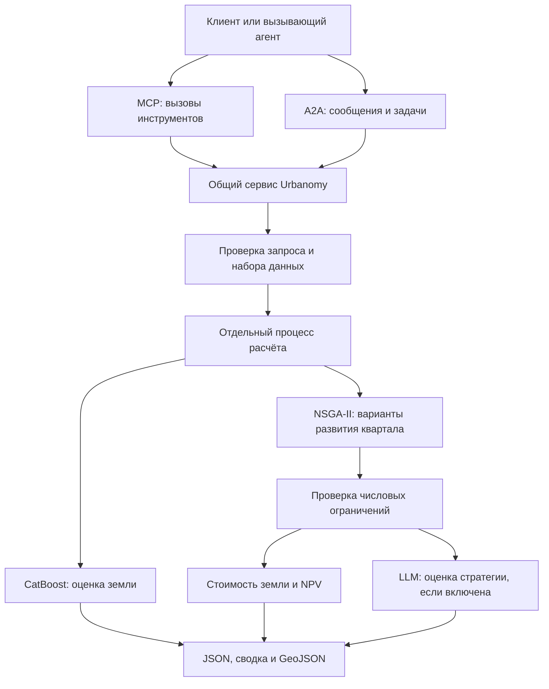

# Urbanomy Agent — оценка земли и оптимизация кварталов

Urbanomy рассчитывает стоимость земли с учётом окружающей застройки и ищет варианты развития выбранного квартала. Оптимизатор NSGA-II сопоставляет экономические показатели и, при включённой LLM, соответствие заданной стратегии. Числовые ограничения проверяются для каждого итогового сценария.

Сервис предоставляет **9 MCP-инструментов** и **2 A2A-навыка** над общим вычислительным ядром. Его можно подключить к Codesynapse или другому совместимому клиенту. Для исследовательской работы доступен [ноутбук](examples/main.ipynb).

## Основные документы

- [Быстрый запуск](RUN.md)
- [Архитектура](docs/architecture.md)
- [Контракт: данные, квартал, constraints и prompt](docs/tool_contract.md)
- [Каталог MCP-инструментов](docs/mcp_tool_catalog.md)
- [Agent Card A2A](docs/a2a_agent_card.md)
- [Развёртывание и настройки](docs/deployment.md)
- [Тесты и проверка установки](tests/README.md)

## Возможности

| Сценарий | Что делает сервис | Что возвращает |
|---|---|---|
| Оценка земли | Применяет обученную CatBoost-модель к зарегистрированному набору кварталов | Стоимость выбранного квартала в рублях, цену за м², общую стоимость набора и GeoJSON |
| Оптимизация без LLM | Меняет параметры выбранного квартала в заданных границах; учитывает стоимость земли и NPV инвестора | Допустимые варианты Парето, экономические показатели и GeoJSON |
| Оптимизация с LLM | Добавляет к экономическим целям оценку соответствия текстовой стратегии | Варианты Парето с оценками `llm_score` |
| Управление расчётом | Выполняет задание в отдельном процессе | Статус, прогресс, результат и возможность отмены |

В оптимизации прирост стоимости земли относится ко **всему набору кварталов**, а NPV — к **выбранному кварталу**. Варианты Парето показывают компромиссы между целями; сервис не выбирает единственный «лучший» вариант за пользователя.

## Как это работает



1. Клиент получает каталог данных и список кварталов, затем выбирает `dataset_id` и `target_id`.
2. Для оптимизации клиент запрашивает исходные показатели и допустимые параметры квартала.
3. Пользователь задаёт жёсткие ограничения в `constraints` и предпочтения в `strategy`.
4. Сервис проверяет запрос и запускает рабочий процесс. NSGA-II ищет сценарии; недопустимые кандидаты не отправляются на оценку LLM.
5. Клиент получает результат через MCP-запросы либо A2A-задачу с артефактами. Долгий расчёт можно отменить.

MCP подходит для пошаговых вызовов из агента. A2A предоставляет задачу со статусами, потоковыми обновлениями и артефактами. Оба интерфейса используют одинаковые расчёты и правила валидации.

## Технологический стек

| Технология | Назначение |
|---|---|
| Python 3.11–3.13 | Выполнение сервиса и расчётов |
| FastAPI / Uvicorn | Общий HTTP-сервер |
| MCP SDK / FastMCP | MCP через Streamable HTTP и stdio |
| A2A SDK | A2A 1.0, JSON-RPC и SSE |
| Pydantic | Проверка входных параметров |
| GeoPandas / Shapely / libpysal | Геоданные, геометрия и пространственное окружение |
| CatBoost | Предобученная модель стоимости земли |
| pymoo / NSGA-II | Многокритериальная оптимизация |
| LangChain OpenAI | Оценка стратегии через настроенного LLM-провайдера |
| pytest / JSON Schema | Проверки расчётов, протоколов и документации |

Зависимости и версии указаны в [pyproject.toml](pyproject.toml). Для локального запуска не нужны отдельная база данных или брокер очередей.

## Быстрый старт

### 1. Установка

Из корня локальной копии репозитория, в macOS/Linux:

```bash
python3.11 -m venv .venv
source .venv/bin/activate
python -m pip install -e '.[dev]'
```

Если окружение `.venv` уже создано, достаточно его активировать и установить проект. В Windows создайте окружение через `py -3.11 -m venv .venv`, затем активируйте `.venv\Scripts\Activate.ps1` в PowerShell.

### 2. Данные и настройки

Проверьте наличие файлов стандартного набора:

```text
data/
├── datasets.json
├── blocks_agg_with_indicators.geojson
└── catboost_land_value_no_services.cbm
```

Для оценки земли и оптимизации без LLM ключ провайдера не нужен. Настройки по умолчанию рассчитаны на запуск из корня репозитория.

Если `.env` ещё нет, создайте его по [.env.example](.env.example). Существующий файл дополните нужными параметрами. Для оптимизации с LLM укажите:

```dotenv
OPENAI_API_KEY=your-provider-key
URBANOMY_LLM_MODEL=your-model-name
# Для OpenAI-compatible провайдера при необходимости:
# OPENAI_BASE_URL=https://your-provider.example/v1
```

Модель и доступ к провайдеру настраиваются на сервере. MCP/A2A-запрос передаёт стратегию, но не ключ API. Перезапустите сервис после изменения настроек.

### 3. Запуск сервера

```bash
python -m urbanomy_agent
```

| Интерфейс | Адрес по умолчанию |
|---|---|
| MCP Streamable HTTP | `http://localhost:8080/mcp` |
| A2A JSON-RPC | `http://localhost:8080/a2a` |
| A2A Agent Card | `http://localhost:8080/.well-known/agent-card.json` |
| Проверка доступности | `http://localhost:8080/health` |

После установки также доступна команда `urbanomy-agent`; прежнее имя `urbanomy-server` сохранено. HTTP-сервис предоставляет протоколы для клиентов; отдельного веб-интерфейса карты в проекте нет.

### 4. Проверка с настоящими данными

Во втором терминале, из корня репозитория:

```bash
source .venv/bin/activate
python scripts/smoke_server.py --compute
```

Скрипт проверяет MCP-каталог, рассчитывает стоимость земли через MCP и выполняет короткую оптимизацию через A2A для набора `baseline`, квартала `86`. При успехе в конце выводится **`PASS`**. LLM в этом запуске отключена.

Если задан `URBANOMY_API_TOKEN`, передайте тот же токен в окружение второго терминала: проверочный скрипт сам `.env` не загружает. Для другого адреса или квартала доступны `--url`, `--dataset` и `--target`.

## Работа через MCP

### Подключение

Для запущенного HTTP-сервера выберите в MCP-клиенте транспорт **Streamable HTTP** и адрес `http://localhost:8080/mcp`. При настроенной авторизации добавьте заголовок `Authorization: Bearer <token>`.

Для локального подключения через **stdio** клиент должен запускать:

```bash
python -m urbanomy_mcp
```

В настройках клиента укажите Python из окружения проекта, аргументы `-m urbanomy_mcp` и рабочую директорию — корень репозитория. Если клиент не поддерживает рабочую директорию, задайте абсолютные пути в `URBANOMY_DATASETS` и `URBANOMY_OUTPUT_DIR`; параметры LLM передайте через окружение. Альтернативная команда после установки — `urbanomy-mcp`.

### Инструменты

| Инструмент | Назначение |
|---|---|
| `list_datasets` | Посмотреть зарегистрированные наборы |
| `list_blocks` | Получить кварталы с пагинацией |
| `get_optimization_options` | Получить геометрию, исходные показатели, единицы и ограничения |
| `estimate_land_value` | Запустить оценку стоимости земли |
| `start_district_optimization` | Запустить оптимизацию квартала |
| `get_job_status` | Проверить состояние и прогресс |
| `get_job_result` | Получить готовый результат и сводку |
| `get_job_geojson` | Получить пространственный результат в WGS84 |
| `cancel_job` | Остановить конкретный расчёт |

### Пример оптимизации

Сначала вызовите `get_optimization_options` для выбранного квартала. Затем передайте инструменту `start_district_optimization`:

```json
{
  "dataset_id": "baseline",
  "target_id": 86,
  "constraints": {
    "l": {"min": 1, "max": 3}
  },
  "strategy": "Предпочитать умеренную плотность застройки.",
  "use_llm": false,
  "pop_size": 4,
  "n_gen": 1,
  "seed": 42
}
```

Это короткий проверочный запуск, а не достаточный бюджет для полноценного исследования. Для содержательного поиска увеличьте `pop_size` и `n_gen`; для оценки стратегии включите `use_llm: true` и настройте провайдера. Допустимые диапазоны: `pop_size` от 4 до 100, `n_gen` от 1 до 200.

Инструмент возвращает `job_id`. Передавайте его в `get_job_status` раз в несколько секунд до состояния `completed`, `failed` или `canceled`. При `completed` запросите `get_job_result` и `get_job_geojson`.

Для оценки земли инструменту `estimate_land_value` достаточно передать `{"dataset_id":"baseline","target_id":86}`; порядок получения результата тот же.

### Квартал, constraints и prompt

| Поле | Смысл |
|---|---|
| `dataset_id` | Идентификатор из каталога данных, не путь к файлу |
| `target_id` | Существующий ID квартала; может поступить из выбора на карте |
| `constraints` | Числовые границы: `{"параметр":{"min":число,"max":число}}` |
| `strategy` | Пользовательский prompt с предпочтениями для LLM |
| `use_llm` | Включить или отключить третью цель — соответствие стратегии |
| `seed` | Начальное значение генератора случайных чисел |

Свободно изменяемые параметры — `footprint_area`, средняя этажность `l` и доли `residential`, `business`, `recreation`, `industrial`, `transport`, `special`, `agriculture`. Неуказанные параметры остаются на исходных значениях; доли предварительно нормализуются до суммы 1. В примере выше меняется только этажность.

Для изменения состава землепользования задайте диапазоны всех долей, которые разрешено менять. Их границы должны допускать сумму 1. Условие `min == max` фиксирует значение.

Ограничения `mxi`, `fsi`, `gsi`, `build_floor_area`, `living_area`, `non_living_area`, `population` проверяются после пересчёта сценария. LLM не может разрешить нарушение границ. При `use_llm=false` поле `strategy` по-прежнему обязательно и сохраняется в результате, но не влияет на поиск.

MCP публикует имя `strategy`; A2A также принимает `prompt`. Подробные зависимости показателей и единицы описаны в [контракте](docs/tool_contract.md).

## Работа через A2A

Агент объявляет два навыка: `estimate_land_value` и `optimize_district`. Контракт — **A2A 1.0**. Для JSON-RPC необходимо передавать заголовок `A2A-Version: 1.0`.

Пример запуска оценки земли на локальном сервере без авторизации:

```bash
curl -sS http://localhost:8080/a2a \
  -H 'Content-Type: application/json' \
  -H 'A2A-Version: 1.0' \
  --data-binary @- <<'JSON'
{
  "jsonrpc": "2.0",
  "id": "estimate-1",
  "method": "SendMessage",
  "params": {
    "message": {
      "messageId": "estimate-message-1",
      "role": "ROLE_USER",
      "parts": [{"data": {
        "operation": "estimate_land_value",
        "dataset_id": "baseline",
        "target_id": "86"
      }}]
    },
    "configuration": {"returnImmediately": true}
  }
}
JSON
```

Ответ содержит `result.task`. Используйте его `id` в последующих JSON-RPC-вызовах:

| Метод | Параметры / поведение |
|---|---|
| `GetTask` | `{"id":"<task-id>"}` — получить состояние и артефакты |
| `CancelTask` | `{"id":"<task-id>"}` — отменить задачу |
| `SendStreamingMessage` | Параметры как у `SendMessage`; статусы и артефакты через SSE |

Если передаёте `tenant` при запуске, указывайте его также при получении и отмене задачи. `returnImmediately=false` ожидает завершения расчёта: таймаут клиента должен быть достаточным.

Для оптимизации передайте `operation: "optimize_district"` и поля из MCP-примера. A2A также принимает ограничения как строку `constraints_json`; одновременно `constraints` и `constraints_json` передавать нельзя. Результаты включаются в артефакты: текстовую сводку, JSON и GeoJSON.

### Подключение к Codesynapse

1. Запустите Urbanomy по адресу, доступному серверу Codesynapse, и задайте его в `URBANOMY_PUBLIC_URL`.
2. Для MCP укажите Streamable HTTP endpoint `https://<host>/mcp` и импортируйте инструменты.
3. Для A2A укажите базовый адрес `https://<host>`; карточка находится по `/.well-known/agent-card.json`, RPC — по `/a2a`.
4. При включённой авторизации настройте Bearer credentials в клиенте.
5. Согласуйте таймауты: в приложенной версии Codesynapse обычный вызов ожидает конечный ответ. Одного возврата ID фоновой задачи для такого сценария недостаточно.

`localhost` внутри удалённого сервера или контейнера обозначает этот сервер или контейнер. Используйте достижимый сетевой адрес. Схема расширения, алиасы методов и особенности ожидания описаны в [контракте Codesynapse](docs/tool_contract.md#a2a-и-codesynapse).

## Данные и результаты

Наборы регистрирует администратор в [data/datasets.json](data/datasets.json). Пути внутри каталога отсчитываются от директории этого файла. Через MCP/A2A нельзя загрузить произвольный файл или заменить модель.

Для собственного набора нужны подготовленные кварталы с признаками оценщика и совместимая CatBoost-модель. Она должна предсказывать `log1p` общей стоимости квартала в рублях. Географические координаты переводятся в метрическую проекцию для расчётов; результаты выдаются в WGS84.

Для стандартного `baseline` явно включено исправление геометрий и исключение вырожденных объектов. Исходные файлы не изменяются. Преобразования, пропуски, контрольные суммы данных и модели записываются в `provenance`. Требования к данным и регистрация своего набора — в [документации](docs/tool_contract.md#данные-и-выбор-квартала).

Файлы расчёта сохраняются в `outputs/server/<job_id>/`:

| Файл | Содержимое |
|---|---|
| `request.json` | Входной запрос |
| `progress.json` | Прогресс оптимизации, если опубликован |
| `result.json` | Успешный результат |
| `scenarios.geojson` | Пространственный результат |
| `error.json` | Ошибка рабочего процесса, если возникла |
| `worker.log` | Журнал расчёта |

## Настройки и Docker

| Переменная | По умолчанию | Назначение |
|---|---|---|
| `URBANOMY_HOST` | `127.0.0.1` | Адрес прослушивания |
| `URBANOMY_PORT` | `8080` | HTTP-порт |
| `URBANOMY_PUBLIC_URL` | `http://localhost:8080` | Внешний адрес в Agent Card |
| `URBANOMY_DATASETS` | `data/datasets.json` | Каталог разрешённых данных |
| `URBANOMY_OUTPUT_DIR` | `outputs/server` | Файлы результатов |
| `URBANOMY_MAX_JOBS` | `2` | Максимум одновременных расчётов |
| `URBANOMY_JOB_TIMEOUT` | `3600` | Лимит времени задания в секундах |
| `URBANOMY_API_TOKEN` | Пусто | Bearer token для HTTP |

Точки входа загружают `.env`; переменные окружения имеют приоритет. Параметры LLM и поддерживаемые алиасы перечислены в [руководстве по развёртыванию](docs/deployment.md).

Для Docker подготовьте `.env` и каталог `data`, затем выполните:

```bash
docker compose up --build -d
docker compose logs -f urbanomy
```

Данные монтируются только для чтения и не включаются в образ. Результаты хранятся в отдельном Docker-томе. Compose публикует порт на `127.0.0.1:8080`. Для удалённого доступа настройте reverse proxy, TLS, публичный адрес и токен.

## Тесты и диагностика

### Автоматические проверки

```bash
python -m pytest -q
```

Проверяются MCP/A2A, авторизация, ограничения, обработка геоданных, отмена, таймауты и ошибки процессов. Тесты используют временные данные и подставные модель/LLM; ключ провайдера и запущенный сервер не нужны. Два теста внешнего контракта пропускаются, если не задан путь к схеме Codesynapse:

```bash
A2A_CONTRACTS_DIR=/path/to/codesynapse-main/docs/contracts/a2a \
  python -m pytest tests/test_codesynapse_contract.py -q
```

Для работающего сервера доступны две проверки:

```bash
python scripts/smoke_server.py
python scripts/smoke_server.py --compute
```

Первая проверяет подключение, каталог и обработку некорректного A2A-запроса; в этом случае `TASK_STATE_FAILED` ожидаем. Вторая выполняет настоящие расчёты без LLM. Обе при успехе заканчиваются `PASS`.

Настоящую LLM проверяйте отдельным коротким запуском `start_district_optimization` с `use_llm=true`, `pop_size=4`, `n_gen=1`. Дождитесь `completed` и проверьте `llm_score` в сценариях. Такой запуск обращается к провайдеру и расходует его квоту; успешный тест подтверждает интеграцию, а не качество стратегии.

### Частые проблемы

| Симптом | Что проверить |
|---|---|
| Не удаётся подключиться | Запущен ли сервер; совпадают ли адрес и порт; доступен ли `/health` |
| HTTP 401 | Совпадает ли Bearer token с `URBANOMY_API_TOKEN` сервера |
| `LLM_NOT_CONFIGURED` | Ключ и название модели в настройках сервера; для работы без LLM используйте `use_llm=false` |
| `NO_FEASIBLE_SOLUTION` | Совместимы ли ограничения; достаточен ли бюджет поиска |
| `SERVER_BUSY` | Заняты все слоты: дождитесь завершения или отмените ненужное задание |
| `TIMEOUT` | Расчёт превысил серверный лимит; оцените бюджет и число LLM-вызовов |
| `CALCULATION_FAILED` | Сообщение об ошибке, соответствие данных модели и `worker.log` |
| A2A отклоняет формат запроса | Заголовок `A2A-Version: 1.0` и поля сообщения по текущему контракту |

Полное описание проверок — в [tests/README.md](tests/README.md).

## Структура проекта

```text
.
├── urbanomy_agent/
│   ├── __main__.py          # Запуск общего HTTP-сервера
│   ├── server.py            # FastAPI, авторизация, жизненный цикл
│   ├── a2a.py               # Agent Card и A2A-задачи
│   ├── service.py           # Общий сервис для обоих протоколов
│   ├── schemas.py           # Входные типы и ограничения
│   ├── jobs.py              # Рабочие процессы и результаты
│   ├── data.py              # Каталог и подготовка геоданных
│   ├── engine.py            # Оценка и оптимизация
│   ├── settings.py          # Настройки сервера
│   ├── llm.py               # Подключение LLM
│   ├── land_value/          # Стоимость земли, сценарии и NSGA-II
│   └── investment/          # Инвестиционные показатели
├── urbanomy_mcp/
│   ├── __main__.py          # Запуск MCP через stdio
│   ├── server.py            # Создание и настройка MCP-сервера
│   └── tools.py             # Определения девяти инструментов
├── data/                   # Каталог, GeoJSON и CatBoost-модель
├── examples/main.ipynb      # Исследовательский ноутбук
├── scripts/                # Проверка сервера и генерация документации
├── tests/                  # Проверки расчётов и протоколов
├── docs/                   # Архитектура, контракты и инструкции
├── .env.example            # Пример настроек без секретов
├── pyproject.toml          # Зависимости и команды запуска
├── Dockerfile
├── compose.yaml
└── RUN.md                  # Краткая инструкция запуска
```

Для ноутбука установите дополнительные зависимости:

```bash
python -m pip install -e '.[notebook]'
jupyter lab examples/main.ipynb
```

При изменении публичных интерфейсов обновите автоматически создаваемые документы:

```bash
python scripts/generate_docs.py
python scripts/generate_docs.py --check
```

Проверка `--check` и тесты не перезаписывают документацию. Карта соответствия кода и тестов находится в [WIKI-LLM.md](docs/WIKI-LLM.md).

## Ограничения текущей реализации

- Оптимизируется один выбранный квартал за запуск. Меняются его показатели; контуры зданий не проектируются, геометрия квартала остаётся прежней.
- LLM оценивает переданные параметры, прирост стоимости и NPV. Доступность школ и другие отсутствующие метрики не становятся измеренными показателями от упоминания в стратегии.
- Загрузка данных, замена моделей, отдельный расчёт инвестиционных метрик, ручное применение сценария и построение графиков не опубликованы отдельными MCP-инструментами.
- Диспетчер не имеет очереди. Статусы и A2A-задачи находятся в памяти; перезапуск останавливает задания без восстановления. Записанные файлы остаются на диске.
- Запускайте один HTTP worker. Несколько процессов или реплик требуют общего хранилища задач и диспетчера расчётов.
- Общий Bearer token рассчитан на доверенную организацию. Разделение A2A-задач по `tenant` не заменяет проверку личности пользователя.
- Не меняйте зарегистрированные файлы во время расчётов. Фиксированный `seed` не гарантирует побитовую воспроизводимость ответов внешней LLM.

Дополнительные сведения: [индекс документации](docs/README.md), [контракты](docs/tool_contract.md), [эксплуатационные ограничения](docs/deployment.md).
