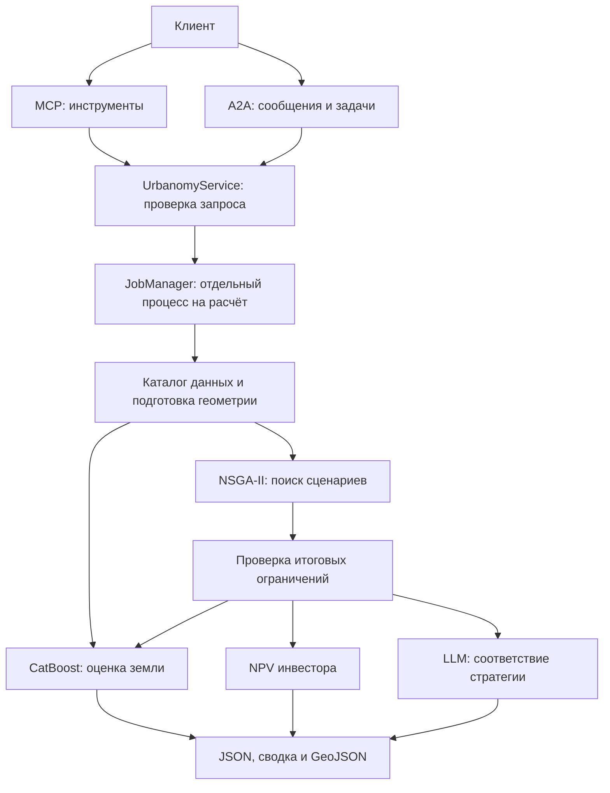

# Архитектура

`urbanomy_agent` содержит расчёты и A2A-адаптер, `urbanomy_mcp` — инструменты MCP.
Один HTTP-процесс обслуживает оба протокола и управляет общим лимитом заданий.
MCP через stdio запускается отдельной командой со своим диспетчером заданий.

## Границы ответственности

| Компонент | Ответственность |
|---|---|
| `urbanomy_agent/server.py` | HTTP-приложение, Bearer-проверка, запуск и остановка |
| `urbanomy_mcp/tools.py` | Имена инструментов, схемы и вызовы общего сервиса |
| `urbanomy_mcp/server.py` | Создание и настройка MCP-сервера |
| `urbanomy_mcp/__main__.py` | Запуск MCP через stdio и остановка диспетчера заданий |
| `urbanomy_agent/a2a.py` | Agent Card, разбор text/data, статусы и артефакты A2A |
| `urbanomy_agent/schemas.py` | Типы запроса, допустимые параметры и границы |
| `urbanomy_agent/service.py` | Каталог кварталов, доступные параметры и запуск |
| `urbanomy_agent/jobs.py` | Процессы, конкурентность, таймауты, отмена и результаты |
| `urbanomy_agent/data.py` | Разрешённые файлы, CRS, качество данных и происхождение |
| `urbanomy_agent/engine.py` | Общий расчёт, строгие ограничения и сводка |
| `urbanomy_agent/land_value/` | Модель стоимости, сценарии и исходный оптимизатор |
| `urbanomy_agent/investment/` | NPV и экономические предположения |
| `urbanomy_agent/llm.py` | Создание LLM по настройкам сервера |

## Путь запроса

1. Клиент указывает `dataset_id` и `target_id`. Для оптимизации также нужны
   ограничения и стратегия. Вызывающий агент уточняет недостающие сведения.
2. Сервис проверяет структуру запроса и регистрацию набора. Подробная проверка
   геоданных и совместимости ограничений выполняется в процессе расчёта.
3. MCP получает `job_id`; A2A создаёт собственный Task ID и связывает его с заданием.
4. Рабочий процесс загружает данные и модель. Оценка учитывает все кварталы набора.
   Оптимизация меняет выбранный квартал; недопустимые кандидаты не отправляются LLM.
5. Результат и GeoJSON сохраняются в `outputs/server/<job_id>/`. MCP возвращает их
   по запросу, A2A помещает содержимое в артефакты и публикует конечный статус.

## Жизненный цикл

Задание переходит из `working` в `completed`, `failed` или `canceled`.
Отмена завершает только его рабочий процесс. Серверный таймаут означает `failed`
с кодом `TIMEOUT`; аварийный выход процесса — `WORKER_EXITED`.
При занятом лимите сервер возвращает `SERVER_BUSY`, очереди нет.

Статусы и A2A TaskStore находятся в памяти. Перезапуск не возобновляет задания,
но уже записанные файлы сохраняются. Для нескольких HTTP workers или реплик
потребуются общий TaskStore и отдельный диспетчер расчётов.

## Что гарантируется

- Оба протокола используют одну схему запроса и одно вычислительное ядро.
- Числовые ограничения проверяются после пересчёта сценария. LLM задаёт только
  дополнительную оценку предпочтений, а не разрешение нарушать ограничения.
- Стратегия постоянна в пределах запуска; результат содержит её и сведения о модели.
- A2A возвращает JSON/GeoJSON и текст, а не пути к файлам на сервере.
- Каталог и карточка в документации генерируются из публичных интерфейсов.

Автономный поиск данных, выбор квартала по адресу, пользовательские роли и
восстановление заданий после перезапуска не реализованы. Подробности:
[контракт](tool_contract.md), [развёртывание](deployment.md), [проверки](../tests/README.md).
